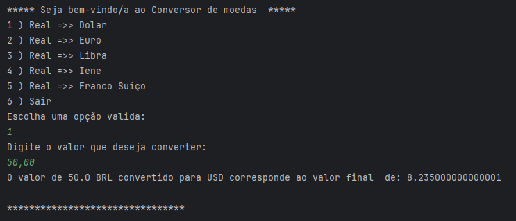

<h1 align="center"> Conversor de Mordas </h1>

#challengeonedecodificador6

Desenvolvido por:
 Jayne Silva - [Github](https://github.com/Za-Jayne)

***

## 1. Resumo do Projeto
Bem-vindo ao projeto Conversor de Moedas. Este é um programa que permite converter valores de Real brasileiro (BRL) para outras moedas:
Dólar;
Euro;
Livra esterlina,
Lene japonês
Franco Suíço

Programa desenvolvido em JAVA, utilizando a API Exchange Rate API.
## 2. Como Usar
- Escolha a moeda de para conversão
- Insira o valor em Real que deseja converter.
- O Programa exibe o resultado da conversão.

- 
